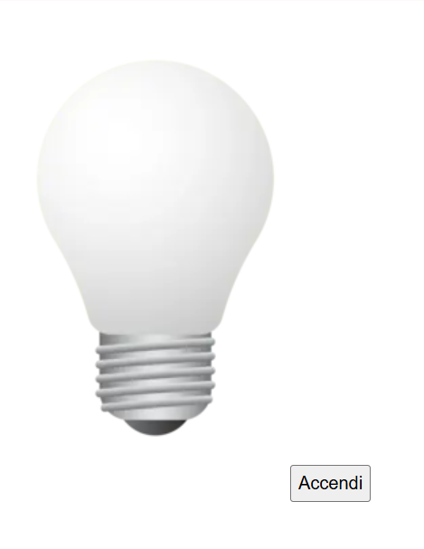
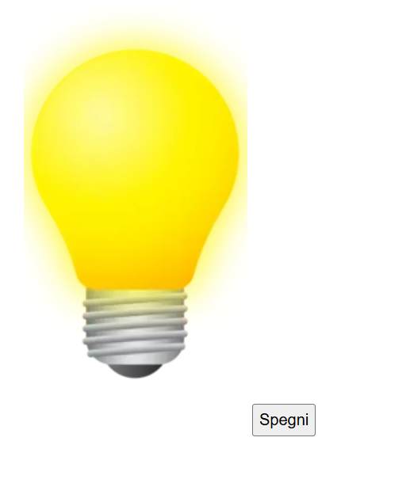

  

<h1 align="center">Lampadina</h1>

Pagina che simula l’accensione di una lampadina tramite JavaScript, modificando il DOM in risposta al click su un bottone.

## Obiettivo

- Mostrare in pagina l’immagine della lampadina spenta e un bottone con etichetta **“Accendi”**.
- Gestire il click sul bottone con JavaScript per:
  - sostituire l’immagine con la versione **accesa**;
  - trasformare il bottone in un interruttore *on/off* cambiando testo tra **“Accendi”** e **“Spegni”**.

## Anteprima

### Lampadina spenta

### Lampadina accesa

## Tecnologie utilizzate

- HTML  
- CSS  
- JavaScript (manipolazione del DOM, gestione eventi)
